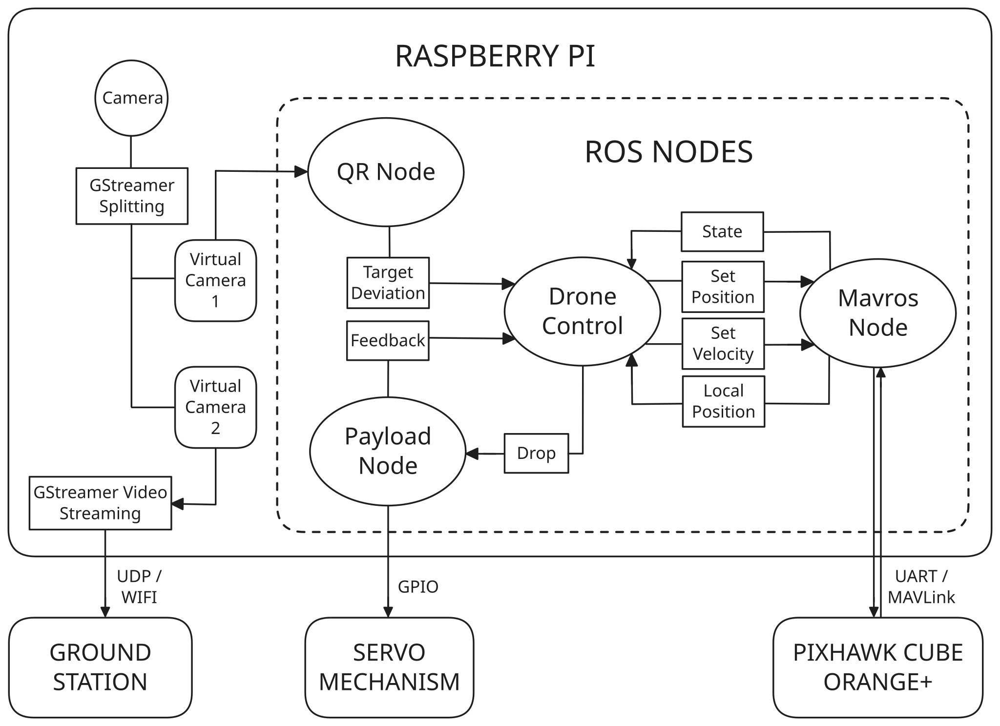

# Skylarks 2.0 — Autonomous UAV Software Stack

<p align="left">
  
  
  
  
  
</p>

ROS 2–based autonomous drone software stack for GPS navigation, QR-based landing, payload delivery, and return-to-launch.  
Designed for deployment on a Raspberry Pi companion computer interfacing with a Pixhawk flight controller via MAVROS.

## Architecture
<p align="center">
  
</p>

High-level ROS2 autonomy architecture showing perception, control, payload actuation, and MAVROS bridge.

## Nodes

- `drone_controller` — Mission state machine featuring dynamic route timeouts, PID velocity alignment, and stale-message target lock watchdogs.
- `qr_detector` — High-resolution (1280x800) QR bounding box processor utilizing OpenCV/`pyzbar` to compute -1.0 to +1.0 Cartesian error vectors.
- `payload_driver` — Asynchronous multithreaded MG90S servo action server.
- `mavros` — Flight controller bridge.

## Resilience & Edge-Case Safety
Several mission-critical fail-safes are hardcoded into the flight stack to ensure autonomy survival during extreme field conditions:
1. **Manual RTL Check:** ArduPilot natively resets the Home GPS location upon a physical landing (such as triggering the payload drop). `drone_controller` dynamically caches the original launch vector and initiates a manual return path, fully bypassing this native FCU quirk.
2. **Camera Target Watchdogs:** The vision loop runs on ROS 2 `qos_profile_sensor_data` which traditionally caches the last broadcast frame indefinitely. A timestamp watchdog instantly severs the ALIGN routine if the camera connection halts, preventing "Ghost Tracking" into obstacles.
3. **Barometric Drift:** Takes off using a relaxed Z-axis ground constraint (`< 1.0m`) coupled with explicit boolean command persistence, preventing the vehicle from deadlocking its motors on the pad during fluctuating barometric weather conditions.
4. **Smart Vision Muting:** QR Code target scanning is entirely suspended during the RTL return phase to guarantee that stray target boards don't corrupt the final GPS-derived landing.

## Mission Flow

```
INIT
  ↓
TAKEOFF
  ↓
TRANSIT
  ↓
SEARCH ──────┐
  ↓          │
QR DETECTED  │ timeout
  ↓          │
LAND <───────┘
  ↓
DROP
  ↓
RTL
```

## Repository Structure

```
.
├── camera.sh            # video split + streaming pipeline
├── exposure.sh          # camera exposure configuration
├── start_mission.sh     # launch full autonomy stack
│
├── docs/
│   └── images/
│       └── architecture.svg
│
└── src/
    ├── drone_control/   # mission FSM + MAVROS control
    ├── vision/          # QR detection node
    ├── payload/         # payload action server
    └── interfaces/      # ROS2 msg + action definitions
```


## Hardware

- Raspberry Pi 4 (companion computer)
- Pixhawk Cube (ArduPilot)
- Arducam OV9281 global shutter camera (1280×800 @ 60 FPS)
- MG90S servo payload mechanism
- GPS module (connected to flight controller)
- USB MAVLink connection (MAVROS)

## Dependencies

- Ubuntu 22.04  
- ROS 2 Humble  
- MAVROS  
- GStreamer  
- v4l2loopback  
- pymap3d  
- pyzbar  

## Setup (Raspberry Pi)

Install ROS2 base

```bash
sudo apt install ros-humble-ros-base
sudo apt install python3-colcon-common-extensions python3-rosdep
```

Clone repository

```bash
git clone https://github.com/aditeya24/skylarks
cd skylarks
```

Install dependencies

```bash
sudo rosdep init
rosdep update
rosdep install --from-paths src --ignore-src -y
```

Install video pipeline dependencies

```bash
sudo apt install v4l2loopback-dkms \
gstreamer1.0-tools \
gstreamer1.0-plugins-good \
gstreamer1.0-plugins-bad
```

Build workspace

```bash
colcon build --symlink-install
source install/setup.bash
```

## Camera Setup

Create virtual cameras

```bash
sudo modprobe v4l2loopback devices=2 video_nr=40,41 \
card_label="StreamFeed","VisionFeed" exclusive_caps=1,1
```

Split camera feed

```bash
gst-launch-1.0 v4l2src device=/dev/video0 ! videoconvert ! \
tee name=t ! queue ! v4l2sink device=/dev/video40 \
t. ! queue ! v4l2sink device=/dev/video41
```


## Mission Workflow

Before running a mission, the following scripts are executed.

### 1. Configure Camera Exposure

```bash
./exposure.sh 4
```

Sets manual exposure and camera parameters for QR detection.

### 2. Start Video Pipeline

```bash
./camera.sh
```

This script:

- creates virtual cameras using v4l2loopback  
- splits camera feed using gstreamer  
- streams video over UDP  
- opens tmux monitoring session  

Devices created

```
/dev/video40  → stream output
/dev/video41  → vision processing
```

### 3. Start Mission

```bash
./start_mission.sh
```

Launches:

- MAVROS  
- drone controller  
- payload driver  
- vision node  
- system monitor

You will be prompted for

- target latitude  
- target longitude  

Mission execution is handled inside a tmux session.


## Video Streaming (Optional)

Stream

```bash
gst-launch-1.0 -v v4l2src device=/dev/video40 ! videoconvert ! \
videoscale ! video/x-raw,width=640,height=400 ! videoconvert ! \
x264enc bitrate=2000 speed-preset=superfast tune=zerolatency ! \
rtph264pay ! udpsink host=<tailscale-ip> port=5000
```

Receive

```bash
gst-launch-1.0 udpsrc port=5000 \
caps="application/x-rtp, media=video, encoding-name=H264, payload=96" \
! rtph264depay ! avdec_h264 ! videoconvert ! autovideosink sync=false
```
